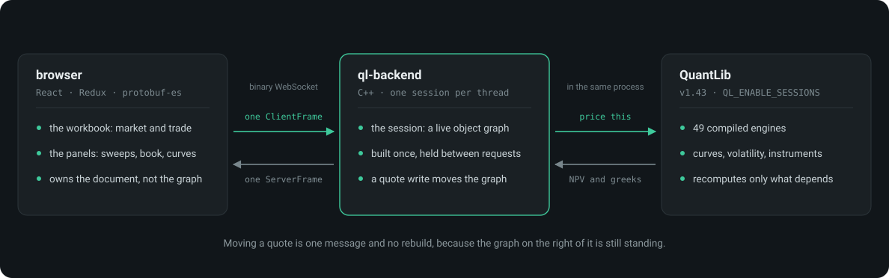
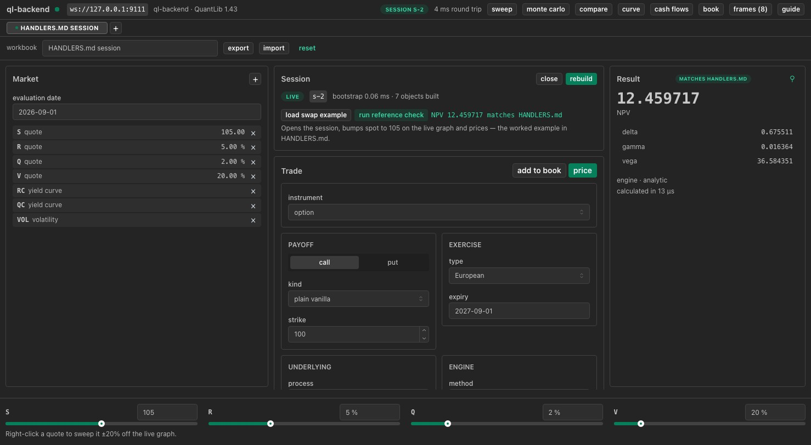

# qlservice

A workbench for pricing options and interest-rate swaps in the browser, backed
by [QuantLib](https://www.quantlib.org/) running as a live service.

Most option calculators are a form and a button: you fill in a market, press
price, and everything is thrown away. This one keeps the market *alive*. The
service builds the object graph once — the curves, the volatility, the index,
the instrument — and holds it between questions, so moving the spot price is a
single number over a socket and the price comes straight back off the graph
that is already standing. Drag a slider and the price follows.

That is the whole idea, and everything else in the application follows from it.



## The layout



The reference check a moment after it ran: one live session, the trade it
priced, and **12.459717** with the greeks beside it. The market is on the left,
the session and the trade down the middle, the result on the right, and the
quote bar along the bottom — that bar is the live one, and dragging it is the
edit that costs nothing. The buttons at the top right open the panels — sweep,
Monte Carlo, compare, curve, cash flows, book — between the columns and the
quote bar, and **guide** at the end of that row opens the user's guide in a
tab of its own. [The interface](doc/interface.md) walks through all of it.

## What you can do with it

- **Build a market** — quotes, curves (flat, interpolated, or bootstrapped from
  deposits and swaps), volatility, an index and its past fixings — and edit it
  without rebuilding anything you did not change.
- **Build a trade** as payoff × exercise × underlying × style. Nine option
  families price here: vanilla, barrier, double barrier, Asian, lookback,
  forward start, compound, chooser and cliquet, with quanto composing over
  four of them. Swaps price too:
  *n* legs, fixed against Ibor, with the schedule you choose.
- **Choose the engine, and see which one ran.** Analytic, lattice (seven trees),
  finite difference, Monte Carlo, integral — 46 compiled engines behind them.
  Every result carries the engine it came from, because two prices are only
  comparable when you know what produced each.
- **Ask a bigger question in one request.** Sweep a quote and get a ladder of
  prices; add a second axis and get the grid, priced as a product off the same
  warm graph. Put trades in a book and price all of them against one market.
- **Watch a long calculation** — a batched Monte Carlo reports as it runs, with
  a progress bar, a convergence trace, and a cancel that keeps the paths it has
  already drawn.
- **Ask what a price implies** rather than what a market implies: tick implied
  volatility, give it a price, and it inverts.
- **See what the numbers rest on** — the curve as the engine sampled it, and the
  cash flows a swap's value adds up to, row by row.

Nothing you can select is refused. Choosing a style closes the exercises,
payoffs, engines and trees the service will not price, and each closed control
says why.

## Try it

Two processes: the pricing service, and this.

```bash
# 1. the service, from the ql-backend checkout
./build/ql-backend --port 9111

# 2. this
npm install          # also generates the Protobuf bindings
npm run dev          # http://localhost:5173
```

Press **run reference check** at the top of the centre column. It prices a
known trade on a known market, and **12.459717** means every link in the chain
is working — socket, schema, market construction, engine dispatch, results.

Then drag a quote slider and watch the price move. Then stop the service and
start it again: the socket reconnects, the market is replayed into a new
session, and the trade reprices, because the browser owns the document and the
service owns only the graph. Cut the connection *without* stopping the service
— pull the network, or kill the socket from the devtools — and something else
happens: the session comes back with the same id, because the service was
still holding it.

## The documentation

| Where | What it covers |
| --- | --- |
| [`doc/`](doc/index.md) | **The user's guide.** How to drive the application, and the mathematics behind every number it can show. `npm run docs` builds it into `doc/_build/html`; see `DEVELOPING.md` for the one-line virtualenv it wants |
| [`UI.md`](UI.md) | The interface in short: the panes, the gestures, and what each control promises |
| [`DEVELOPING.md`](DEVELOPING.md) | The developer's page: the code, the file map, and what each milestone added |
| [`PLAN.md`](PLAN.md) | The design record, including the parts that were planned and not built |
| [`TESTING.md`](TESTING.md) | The suites, and what each check is guarding |
| `ql-backend/HANDLERS.md` | Every frame and field the service accepts, with the rules |
| `ql-backend/DESIGN.md` | Why the service is shaped this way, cited to QuantLib's own source |

## What it is not

Worth knowing before you judge a number it gives you:

- **One model.** Everything prices in the Black-Scholes world with one
  volatility per expiry and strike. Heston, Bates and local volatility are in
  the schema and are not built, so an exotic price here is a Black-Scholes
  price.
- **Nine of twelve styles.** Basket and spread are expressible and not priced,
  and the interface does not offer them. `digital` is the twelfth and a
  different case: a knock digital is a barrier carrying a binary payoff, and
  *that* trade prices, so the style arm is the schema describing the same
  product twice rather than an engine that is missing.
- **A cliquet with no caps.** The four cap and floor fields reach no engine —
  `CliquetOption` never copies them — so they are refused by name rather than
  priced without. An uncapped ratchet is a real trade; a capped one described
  here would have been an uncapped one with a misleading label.
- **Continuous monitoring.** The barrier and lookback closed forms assume the
  level is watched continuously, which is worth more than a contract watched
  daily.
- **A single machine, and no authentication.** The service listens on loopback,
  checks the browser's origin, and caps sockets and sessions. That is a door,
  not a security model: it is a bet that the attacker is a page rather than a
  process, which is right on your own machine and wrong anywhere else.
- **A session outlives its socket by a minute, and not by more.** Lose the
  connection and the service holds the session — and whatever was running in
  it — for its grace window; come back later, or to a service that has been
  restarted, and the client replays the market into a new one. The document
  lives in the browser either way, which is what makes the fallback work.

The pricing is checked rather than asserted: the service prices **312 rows of
QuantLib's published reference values** over the wire on every run, each within
the tolerance QuantLib's own test uses, and the rows are extracted from its
test suite rather than typed in.
